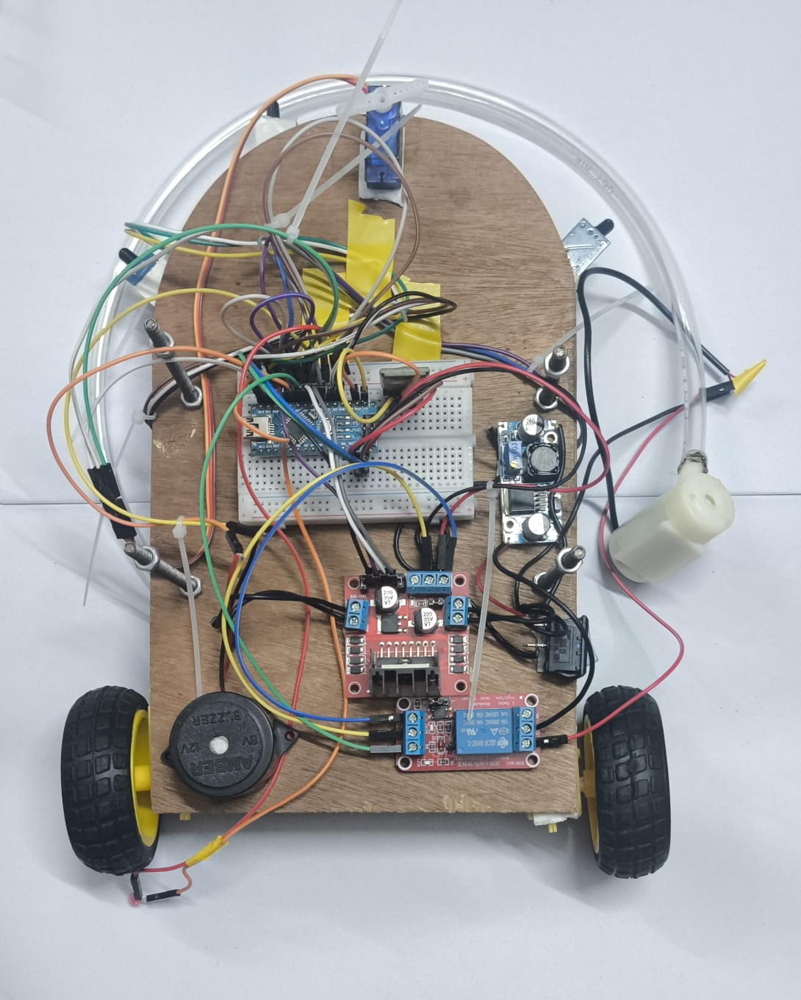

# 🔥🚗 Bluetooth Fire Fighting Robot using Arduino Nano

A **Bluetooth-controlled firefighting robot** built using **Arduino Nano, HC-05 Bluetooth module, flame sensors, and a water pump system**.
The robot can move wirelessly through a smartphone and automatically detect fire and spray water using a pump mechanism.

---

## 📌 Table of Contents

* <a href="#overview">Overview</a>
* <a href="#problem-statement">Problem Statement</a>
* <a href="#project-features">Project Features</a>
* <a href="#hardware-components">Hardware Components</a>
* <a href="#car-view">Car View</a>
* <a href="#folder-structure">Folder Structure</a>
* <a href="#how-it-works">How It Works</a>
* <a href="#how-to-run-the-project">How to Run the Project</a>
* <a href="#demo-video">Demo Video</a>
* <a href="#results">Results</a>
* <a href="#future-improvements">Future Improvements</a>
* <a href="#author">Author</a>

---

## 🔍 Overview

This project demonstrates the design and implementation of a **Bluetooth Controlled Fire Fighting Robot** using an **Arduino Nano**.

The robot receives movement commands from a smartphone via the **HC-05 Bluetooth module** and controls DC motors through an **L298N motor driver**.

To improve safety functionality, the robot includes **three flame sensors** that detect fire. When fire is detected, the system activates a **relay-controlled water pump** and directs the water spray using a **servo motor**.

The robot is built on a **two-layer wooden chassis**, allowing the **water tank and electronics to remain separated**, reducing the risk of water damage.

---

## ❓ Problem Statement

Fire accidents can cause serious damage to property and human life. Traditional firefighting methods sometimes expose humans to dangerous environments.

This project aims to develop a **low-cost robotic system capable of detecting fire and spraying water automatically while being controlled wirelessly through Bluetooth**.

The robot demonstrates how **embedded systems and robotics** can assist in improving safety and automation.

---

## ✨ Project Features

* Wireless Bluetooth control using smartphone
* Forward, backward, left, right and stop movements
* Fire detection using **three flame sensors**
* Automatic water pump activation when fire is detected
* Servo motor controlled **water nozzle direction**
* LED and buzzer alert system
* Two-layer wooden chassis for better component organization
* Low-cost design suitable for educational robotics projects

---

## 🔩 Hardware Components

* Arduino Nano
* HC-05 Bluetooth Module
* L298N Motor Driver Module
* 2 × BO DC Motors with wheels
* 3 × Flame Sensors
* SG90 Servo Motor
* 5V Water Pump
* Relay Module
* LED Indicator
* Buzzer / Speaker
* 18650 Li-ion Batteries
* DC-DC Buck Converter
* Wooden chassis base
* Nuts, bolts and jumper wires

📄 Detailed list available in:
`"requirements\Component Requirements.txt"`

---

## 🔌 Car View



---

## 📁 Folder Structure

```
bluetooth-fire-fighting-robot/
│
├── README.md
├── requirements.txt
│
├── code/
│   └── fire_fighting_robot_arduino_nano/
│       └── Fire_Fighting_Robot_Arduino_Nano.ino
│
├── media/
│   ├── robot_photo/
│   │   ├── robot_front.jpeg
│   │   ├── robot_back.jpeg
│   │   ├── robot_components.jpeg
│   └── demo_video_link.txt
│
├── report/
│   └── bluetooth_controlled_fire_fighting_robot_using_arduino_nano.pdf

```

---

## ⚙️ How It Works

1. The smartphone sends movement commands via Bluetooth
2. The **HC-05 Bluetooth module** receives commands and sends them to Arduino Nano
3. Arduino processes the commands and controls the **L298N motor driver**
4. Motors move the robot accordingly
5. Flame sensors continuously monitor for fire
6. When fire is detected:

   * Robot stops
   * LED and buzzer activate
   * Servo motor aligns the nozzle
   * Relay turns on the water pump
7. Water is sprayed to extinguish the fire

---

## ▶️ How to Run the Project

1. Install **Arduino IDE**
2. Connect **Arduino Nano to PC using USB**
3. Open the `.ino` file from:

```
"code\Bluetooth_Controlled_RC_Car_Arduino_Nano.ino"
```

4. Select the following settings:

* Board → **Arduino Nano**
* Processor → **ATmega328P**
* Port → **COM Port**

5. Upload the code
6. Power the robot
7. Pair the **HC-05 Bluetooth module** with your smartphone
8. Control the robot using **Serial Bluetooth Terminal**

---

## 🎥 Demo Video

Watch the working demo here:

[https://drive.google.com/file/d/1HA-GH6swl0WtCEgR7G8Eb3HfLAJ5L8d5/view?usp=drivesdk](https://drive.google.com/file/d/1HA-GH6swl0WtCEgR7G8Eb3HfLAJ5L8d5/view?usp=drivesdk)

---

## ✅ Results

* Successful wireless control using Bluetooth
* Reliable fire detection using flame sensors
* Automatic water spraying system implemented
* Stable robotic movement achieved

---

## 🔮 Future Improvements

* Add **ultrasonic sensor for obstacle avoidance**
* Develop a **custom Android control application**
* Integrate **camera module for remote monitoring**
* Improve **water pressure and nozzle design**
* Implement **Wi-Fi based long-range control**

---

## 👤 Author

**Janmejoy Chakraborty**
Electronics and Communication Engineering
Dr. B. C. Roy Engineering College, Durgapur

📧 Email: [janmejoychakraborty1020@gmail.com](mailto:janmejoychakraborty1020@gmail.com)

🔗 LinkedIn
[https://www.linkedin.com/in/janmejoy-chakraborty-8a9164319/](https://www.linkedin.com/in/janmejoy-chakraborty-8a9164319/)

---

⭐ If you like this project, don’t forget to **star the repository**!

---
